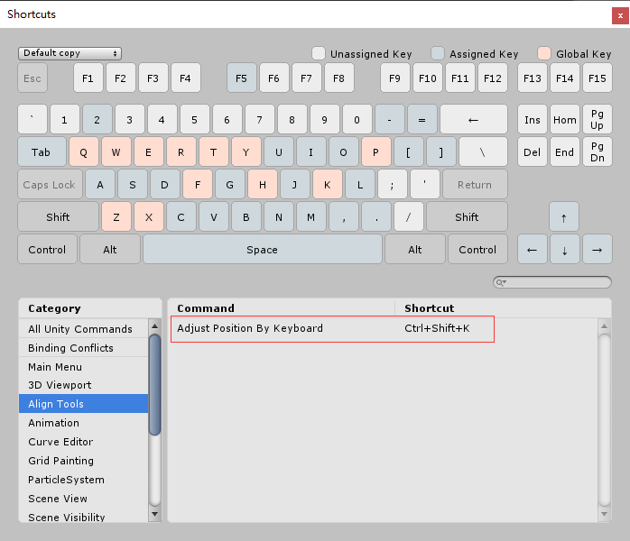

# Align Tools by litefeel  
https://www.litefeel.com

Twitter: @litefeel  
Github: https://github.com/litefeel/Unity-AlignTools

_________
#### What does it do ?

This editor window allows you to easily align ui objects on your scene :
- align ui objects on all axis or the one you choose
- align on the left or the right (use renderer extents)
- distribute objects in equals distances (for position)
- expand/shrink size of ui by another
- adjust position of ui by arrow keyboard

____
#### Usage

1. Open Windows from `Window > LiteFeel > Align Tools`
2. Select two or more GUI object
3. Align them

____
#### Adjust position by keyboard

1. Toggle on `Adjust Position By Keyboard` at `Align Tools Window`
2. Select one or more ui object
3. Press the arrow keys (Options Press Shift)

#### Screenshots

