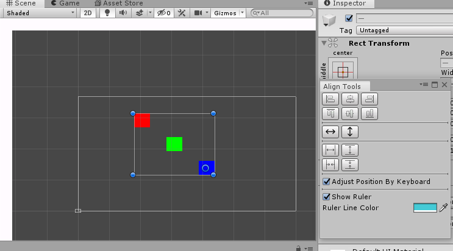

# Align Tools


[](https://github.com/litefeel/Unity-AlignTools/actions)
[](https://github.com/litefeel/Unity-AlignTools/releases)
[](https://github.com/litefeel/Unity-AlignTools/blob/upm/LICENSE.md)
[](https://paypal.me/litefeel)

[Align Tools][AlignTools] is just perfect Unity asset plugin to align game object.  

## Feature list

- Free
- Align game object
- Distribute GUI object
- Tested with Unity 2018 and 2019 
- No runtime resources required
- No scripting required

## Install

#### Using UnityPackageManager (for Unity 2018.3+)

Find the manifest.json file in the Packages folder of your project and edit it to look like this:
``` js
{
  "dependencies": {
    "com.litefeel.aligntools": "https://github.com/litefeel/Unity-AlignTools.git#upm",
    ...
  }
}
```

#### Using .zip file (for Unity 5.0+)

1. Download `Source code` from [Releases](https://github.com/litefeel/Unity-AlignTools/releases)
2. Extract the package into  `$UnityProject/Packages` or `$UnityProject/Assets/Plugins`


#### How to use?

1. Open Windows from [Windows] > [LiteFeel] > [Align Tools] > [Align Tools]
2. Select two or more GUI object
3. Align them

#### Adjust position by keyboard

1. Toggle on Menu item `Adjust Position By Keyboard` at `Window/LiteFeel/Align Tools/Align Tools`
2. Select one or more ui object
3. Press the arrow keys (Options Press Ctrl)

#### Screenshots



## Support

- Create issues by [issues][issues] page
- Send email to me: <litefeel@gmail.com>


[AlignTools]: https://github.com/litefeel/Unity-AlignTools (AlignTools)
[issues]: https://github.com/litefeel/Unity-AlignTools/issues (AlignTools issues)
